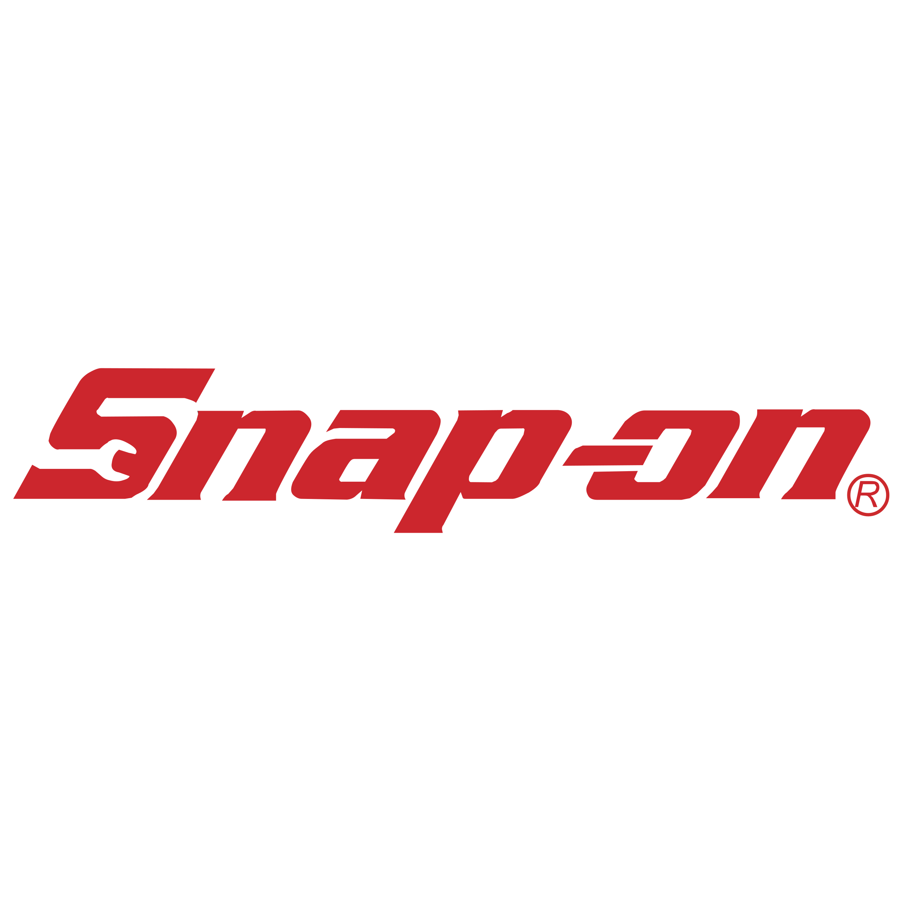

<h1 align="center">Hi I'm Ryan Clark</h1>

  

  

  

---

## About Me

\- Obtained my Degree at Ira A. Fulton Schools of Engineering at Arizona State University for Computer Science (CyberSecurity). Network Operations Intern at General Dynamics Mission Systems. While at Arizona state working at a small Building management company as a IT Systems Engineer. Responsible for information technology initiatives, strategy, operations and maintenance. Oversaw the IT systems required to support the organization's unique objectives and goals. Implemented security protocols and procedures as well as preventative maintenance on machines in multiple company buildings.

\- Started a clothing brand in 2018 called [Goose Customs](https://www.goosecustoms.net/), which has grown over the years and taught me how to create and manage an eCommerce business.

\- Adamant amateur 5k/10k/Half-Marathon/Marathon race runner. President of [Sun Devil® Run Club](https://linktr.ee/sundevilrunclub/), An ASU-run club thats focused on motivating people to move and prepare for regular races and track races. 
Relationship with Drink LMNT

---

<h2>🏆 Certifications</h2>

<table border="0" cellspacing="20" cellpadding="15" align="center">
<tr>

<td align="center" width="25%">

  

<b>Cisco</b>  

CCNA Enterprise Networking, 
Security & Automation  

CCNA Switching, Routing & 
Wireless Essentials

</td>

<td align="center" width="25%">

  

<b>TestOut</b>  

Security Pro  

Client Pro  

Office Pro

</td>

<td align="center" width="25%">

  

<b>OSHA</b>  

10-Hour General Industry

</td>

<td align="center" width="25%">

  

<b>Snap-on</b>  

Meter Certification

</td>

</tr>
</table>

  
<h2>📘 My Projects</h2>

  

  
  
  
  
  
  

 

